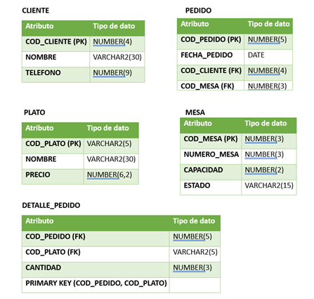
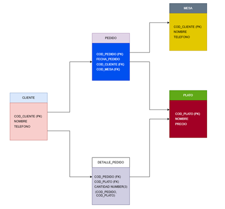
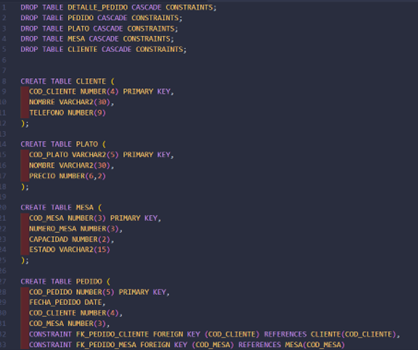
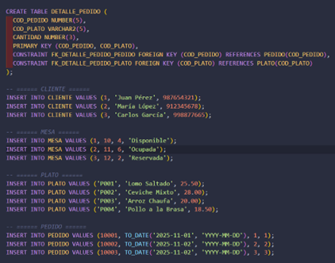
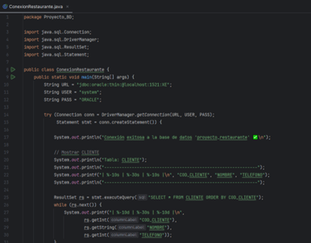
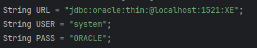

# Sistema de Gestión de Restaurante - Oracle 11g

Base de datos para administración de restaurante implementada en Oracle 11g con conexión Java.

## Integrantes del Grupo

- Michael Fernandez
- Jhon Malpartida
- Carlos Andia

## Descripción del Proyecto

Sistema de base de datos diseñado para gestionar las operaciones de un restaurante, incluyendo:

- **Gestión de Clientes**: Registro y control de información de clientes
- **Control de Mesas**: Administración de mesas con capacidad y estados
- **Registro de Pedidos**: Sistema de pedidos vinculado a clientes y mesas
- **Catálogo de Platos**: Menú con precios y detalles
- **Detalle de Pedidos**: Relación entre pedidos y platos solicitados

## Tecnologías Utilizadas

- **Oracle Database 11g Express Edition**
- **SQL*Plus** - Herramienta de línea de comandos
- **Java** - Lenguaje de programación para la aplicación
- **Oracle JDBC Driver** (ojdbc8.jar) - Conector Java-Oracle
- **Visual Studio Code** - Editor de código

## Estructura del Proyecto
```
tarea/
├── README.md              # Este archivo
├── .gitignore            # Archivos a ignorar por Git
├── docs/                 # Documentación
│   ├── instalacion.md
│   ├── conexion.md
│   └── screenshots/      # Capturas de pantalla
├── database/             # Scripts SQL
│   ├── schema.sql        # Limpieza de tablas
│   ├── tablas.sql        # Creación de tablas
│   ├── datos.sql         # Datos de ejemplo
│   └── consultas.sql     # Consultas de prueba
├── diagrams/             # Diagramas
│   └── diagrama_er.png   # Diagrama Entidad-Relación
└── app/                  # Aplicación Java
    ├── ConexionRestaurante.java
    └── lib/
        └── ojdbc8.jar    # Driver JDBC
```

## Modelo de Base de Datos

### Entidades Principales

1. **CLIENTE** - Información de los clientes del restaurante
2. **MESA** - Mesas disponibles con capacidad y estado
3. **PLATO** - Menú de platos con precios
4. **PEDIDO** - Pedidos realizados por clientes
5. **DETALLE_PEDIDO** - Items específicos de cada pedido

### Diagrama Entidad-Relación




## Instalación y Configuración

### Requisitos Previos

- Windows 10/11
- Oracle Database 11g Express Edition
- Java Development Kit (JDK) 8 o superior
- SQL*Plus (incluido con Oracle)

### Pasos de Instalación

Ver documentación detallada en: [docs](Instalación de Oracle 11g y conexion.docx)

1. Descargar e instalar Oracle 11g XE
2. Configurar contraseña de administrador (recomendado: SYSTEM o ORACLE)
3. Verificar que el servicio OracleServiceXE esté activo
4. Conectar mediante SQL*Plus

## Configuración de Base de Datos

### Opción 1: Ejecutar scripts por separado
```bash
# 1. Conectar a SQL*Plus
sqlplus system/tu_contraseña

# 2. Ejecutar scripts en orden
@database/schema.sql
@database/tablas.sql
@database/datos.sql
```

### Opción 2: Desde CMD (sin abrir SQL*Plus)
```bash
sqlplus system/tu_contraseña @database/schema.sql
sqlplus system/tu_contraseña @database/tablas.sql
sqlplus system/tu_contraseña @database/datos.sql
```

### Verificar instalación
```bash
sqlplus system/tu_contraseña @database/consultas.sql
```

## Aplicación Java

### Configuración

El driver JDBC (ojdbc8.jar) está incluido en `app/lib/`

### Compilar
```bash
javac -cp "app/lib/ojdbc8.jar" app/ConexionRestaurante.java
```

### Ejecutar

**Windows:**
```bash
java -cp "app/lib/ojdbc8.jar;app" ConexionRestaurante
```

**Linux/Mac:**
```bash
java -cp "app/lib/ojdbc8.jar:app" ConexionRestaurante
```

## Capturas de Pantalla


### Conexión SQL*Plus





### Aplicación Java Funcionando





## Solución de Problemas

### Error: Oracle service no está corriendo

1. Presionar Win + R
2. Escribir: `services.msc`
3. Buscar: OracleServiceXE
4. Clic derecho → Iniciar

### Error de conexión JDBC

- Verificar puerto: 1521
- Usuario: system
- Service Name: XE
- Hostname: localhost

### Error: TNS no listener
```bash
# Verificar que el listener esté corriendo
lsnrctl status
lsnrctl start
```


## Funcionalidades Implementadas

- Instalación y configuración de Oracle 11g
- Conexión mediante SQL*Plus
- Diseño de esquema de base de datos
- Diagrama Entidad-Relación
- Creación de tablas con relaciones
- Inserción de datos de prueba
- Aplicación Java con conexión JDBC
- Consultas SQL funcionales

## Coordinador del Repositorio

---

**Proyecto Académico** - Base de Datos | Tecsup | Noviembre 2025