# Sistema de Gestión de Restaurante - Oracle 11g

Base de datos para administración de restaurante implementada en Oracle 11g con conexión Java.

## Integrantes del Grupo

- Michael Fernandez
- Jhon Malpartida
- Carlos Andia

## Descripción del Proyecto

Sistema de base de datos diseñado para gestionar las operaciones de un restaurante, incluyendo:

- **Gestión de Clientes**: Registro y control con operaciones CRUD completas mediante procedimientos almacenados
- **Control de Mesas**: Administración de mesas con capacidad y estados
- **Registro de Pedidos**: Sistema de pedidos vinculado a clientes y mesas
- **Catálogo de Platos**: Menú con precios y detalles
- **Detalle de Pedidos**: Relación entre pedidos y platos solicitados
- **Validaciones**: Constraints para garantizar integridad de datos
- **Optimización**: Índices para mejorar rendimiento de consultas
- **Auditoría**: Trigger para registrar historial de cambios automáticamente
- **Reportes**: Vistas para consultas complejas simplificadas

## Tecnologías Utilizadas

- **Oracle Database 11g Express Edition**
- **SQL*Plus** - Herramienta de línea de comandos
- **Java** - Lenguaje de programación para la aplicación
- **Oracle JDBC Driver** (ojdbc8.jar) - Conector Java-Oracle
- **Visual Studio Code** - Editor de código

## Estructura del Proyecto
```
tarea/
├── README.md              # Este archivo
├── .gitignore            # Archivos a ignorar por Git
├── docs/                 # Documentación
│   ├── instalacion.md
│   ├── conexion.md
│   └── screenshots/      # Capturas de pantalla
├── database/             # Scripts SQL
│   ├── schema.sql        # Limpieza de tablas
│   ├── tablas.sql        # Tablas, constraints, índices, procedimientos, triggers y vistas
│   ├── datos.sql         # Datos de ejemplo
│   └── consultas.sql     # Consultas de prueba
├── diagrams/             # Diagramas
│   ├── Imagen1.png       # Diagrama Entidad-Relación parte 1
│   └── Imagen2.png       # Diagrama Entidad-Relación parte 2
└── app/                  # Aplicación Java
    ├── src/
    │   └── ProyectoBD/
    │       ├── Conexion.java          # Clase de conexión a BD
    │       ├── ClienteDAO.java        # Operaciones CRUD con procedimientos
    │       └── ConexionRestaurante.java  # Clase principal con menú
    └── lib/
        └── ojdbc8.jar    # Driver JDBC
```

## Modelo de Base de Datos

### Entidades Principales

1. **CLIENTE** - Información de los clientes del restaurante
2. **MESA** - Mesas disponibles con capacidad y estado
3. **PLATO** - Menú de platos con precios
4. **PEDIDO** - Pedidos realizados por clientes
5. **DETALLE_PEDIDO** - Items específicos de cada pedido
6. **HISTORIAL_CLIENTE** - Auditoría de cambios (generada por trigger)

### Diagrama Entidad-Relación


## Instalación y Configuración

### Requisitos Previos

- Windows 10/11
- Oracle Database 11g Express Edition
- Java Development Kit (JDK) 8 o superior
- SQL*Plus (incluido con Oracle)

### Pasos de Instalación

1. Descargar e instalar Oracle 11g XE
2. Configurar contraseña de administrador (recomendado: SYSTEM o ORACLE)
3. Verificar que el servicio OracleServiceXE esté activo
4. Conectar mediante SQL*Plus

## Configuración de Base de Datos

### Opción 1: Ejecutar scripts por separado
```bash
# 1. Conectar a SQL*Plus
sqlplus system/tu_contraseña

# 2. Ejecutar scripts en orden
@database/schema.sql
@database/tablas.sql
@database/datos.sql
```

### Opción 2: Desde CMD (sin abrir SQL*Plus)
```bash
sqlplus system/tu_contraseña @database/schema.sql
sqlplus system/tu_contraseña @database/tablas.sql
sqlplus system/tu_contraseña @database/datos.sql
```

### Verificar instalación
```bash
sqlplus system/tu_contraseña @database/consultas.sql
```

## Aplicación Java

La aplicación está estructurada en 3 clases para mejor organización:

- **Conexion.java**: Maneja la conexión a la base de datos
- **ClienteDAO.java**: Implementa operaciones CRUD usando procedimientos almacenados y consultas a vistas
- **ConexionRestaurante.java**: Clase principal con menú interactivo de 7 opciones

### Configuración

El driver JDBC (ojdbc8.jar) está incluido en `app/lib/`

### Compilar
```bash
cd app/src
javac -cp "../lib/ojdbc8.jar" ProyectoBD/*.java
```

### Ejecutar

**Windows:**
```bash
cd app/src
java -cp "../lib/ojdbc8.jar;." ProyectoBD.ConexionRestaurante
```

**Linux/Mac:**
```bash
cd app/src
java -cp "../lib/ojdbc8.jar:." ProyectoBD.ConexionRestaurante
```

## Características Avanzadas Implementadas

### Procedimientos Almacenados

Permiten ejecutar operaciones CRUD de forma segura y centralizada en la base de datos:

#### SP_INSERTAR_CLIENTE
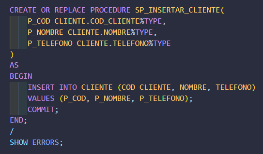

#### SP_ACTUALIZAR_CLIENTE
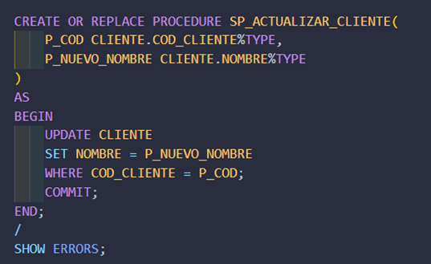

#### SP_ELIMINAR_CLIENTE
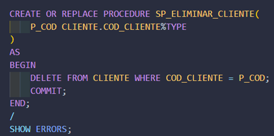

### Triggers (Disparadores)

Sistema de auditoría automática que registra todas las operaciones sobre la tabla CLIENTE:

#### Tabla de Historial
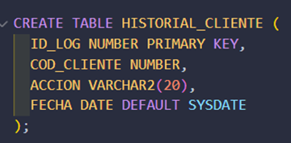

#### Secuencia Automática
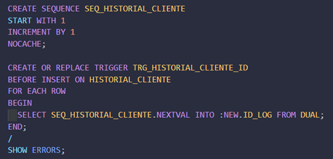

#### Trigger Principal
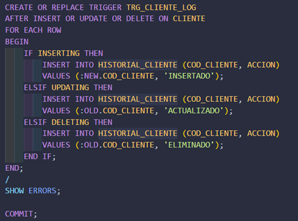

### Vistas

Consultas complejas simplificadas para reportes y análisis:

#### Vista de Pedidos Completos
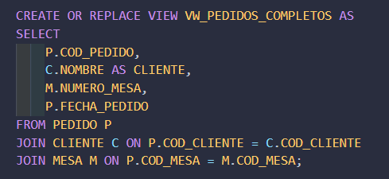

#### Vista de Detalle de Pedidos
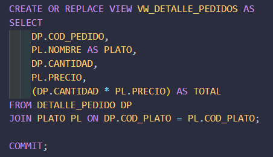

## Implementación en Java

### Código ClienteDAO con CallableStatement

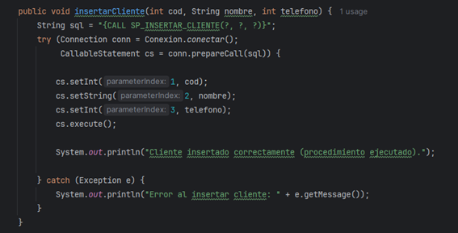
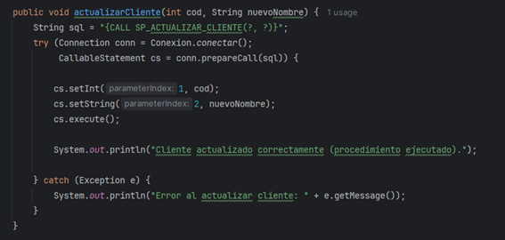

### Menú Principal Actualizado

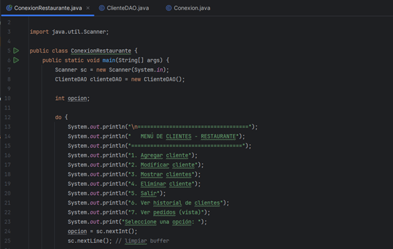

## Demostración de Funcionalidades

### Constraints e Índices

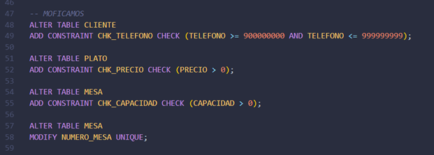
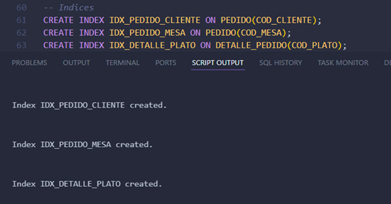

### Código Java Original (Entrega 2)

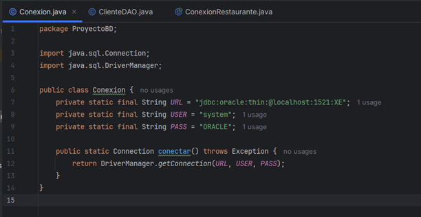
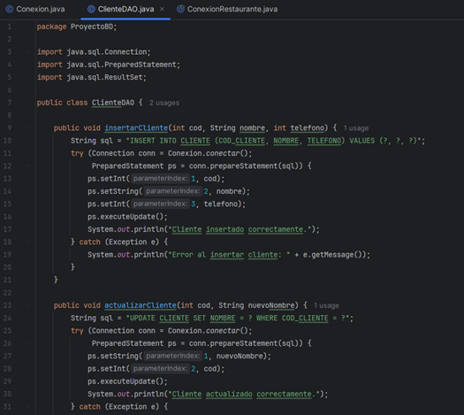


### Operaciones CRUD

#### Agregar Clientes

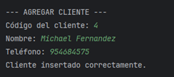
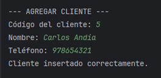
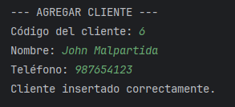

#### Visualizar Clientes

**En Aplicación Java:**
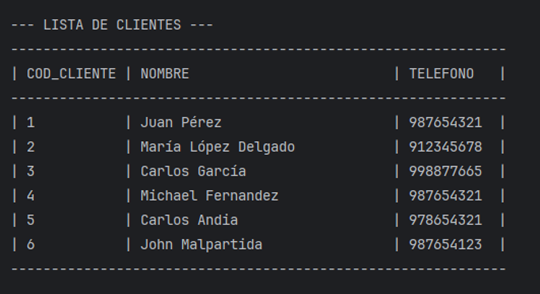

**En Base de Datos Oracle:**
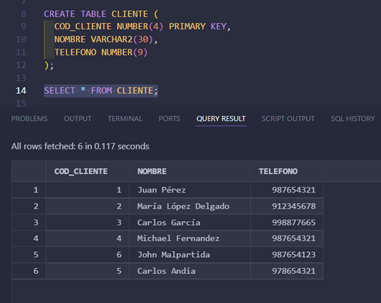

#### Modificar Cliente

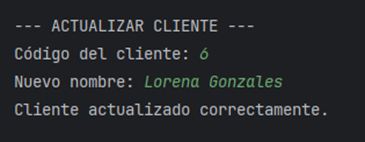
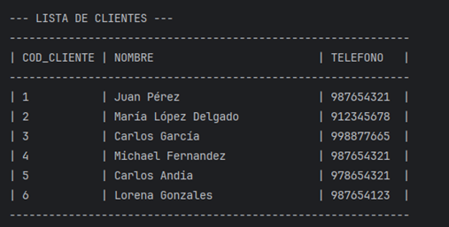

#### Eliminar Cliente

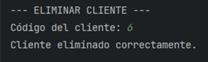
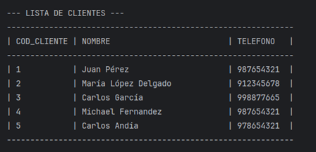

### Nuevas Funcionalidades (Entrega 3)

#### Historial de Clientes (Trigger)


#### Vista de Pedidos Completos


### Conexión SQL*Plus


### Aplicación Java en Ejecución


## Solución de Problemas

### Error: Oracle service no está corriendo

1. Presionar Win + R
2. Escribir: `services.msc`
3. Buscar: OracleServiceXE
4. Clic derecho → Iniciar

### Error de conexión JDBC

- Verificar puerto: 1521
- Usuario: system
- Service Name: XE
- Hostname: localhost

### Error: TNS no listener
```bash
# Verificar que el listener esté corriendo
lsnrctl status
lsnrctl start
```

## Características Implementadas

### Base de Datos
- Instalación y configuración de Oracle 11g
- Conexión mediante SQL*Plus
- Diseño de esquema normalizado
- Diagrama Entidad-Relación completo
- Creación de tablas con relaciones (Foreign Keys)
- Constraints de validación (CHECK)
- Constraints de unicidad (UNIQUE)
- Índices para optimización de consultas
- **Procedimientos almacenados** para operaciones CRUD
- **Triggers** para auditoría automática
- **Vistas** para consultas complejas
- Inserción de datos de prueba

### Aplicación Java
- Arquitectura en capas (Conexión, DAO, Main)
- Conexión JDBC con Oracle
- **Invocación de procedimientos almacenados** mediante CallableStatement
- Operaciones CRUD completas:
  - **Create**: Agregar nuevos clientes (mediante procedimiento)
  - **Read**: Listar todos los clientes
  - **Update**: Modificar nombre de cliente (mediante procedimiento)
  - **Delete**: Eliminar cliente por código (mediante procedimiento)
- **Consulta de historial** de cambios (tabla generada por trigger)
- **Consulta de vistas** para reportes
- Menú interactivo de consola con 7 opciones
- Manejo de excepciones
- Prepared Statements y Callable Statements para seguridad

## Conclusiones

- **Procedimientos Almacenados**: Centralizan la lógica de negocio en la base de datos, mejorando seguridad y mantenibilidad
- **Triggers**: Permiten auditoría automática sin intervención manual, facilitando trazabilidad completa
- **Vistas**: Simplifican consultas complejas y mejoran la organización de reportes
- **Arquitectura en capas**: Separa responsabilidades y facilita el mantenimiento del código

## Coordinador del Repositorio

Carlos Andia - Organización y documentación del proyecto GitHub

---

**Proyecto Académico** - Base de Datos | Tecsup | Noviembre 2025